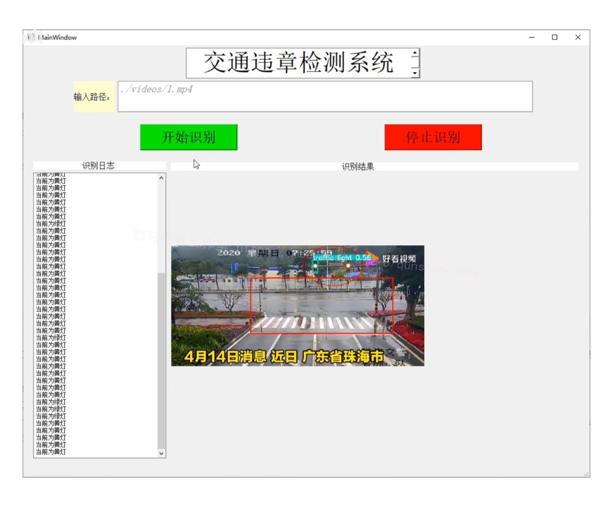
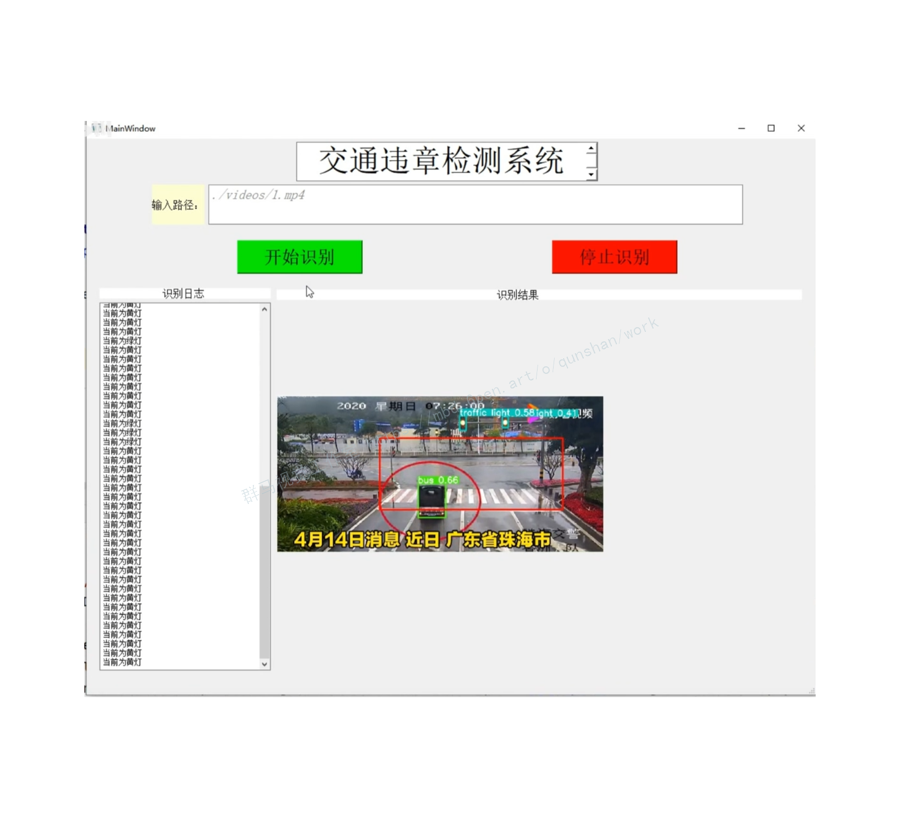
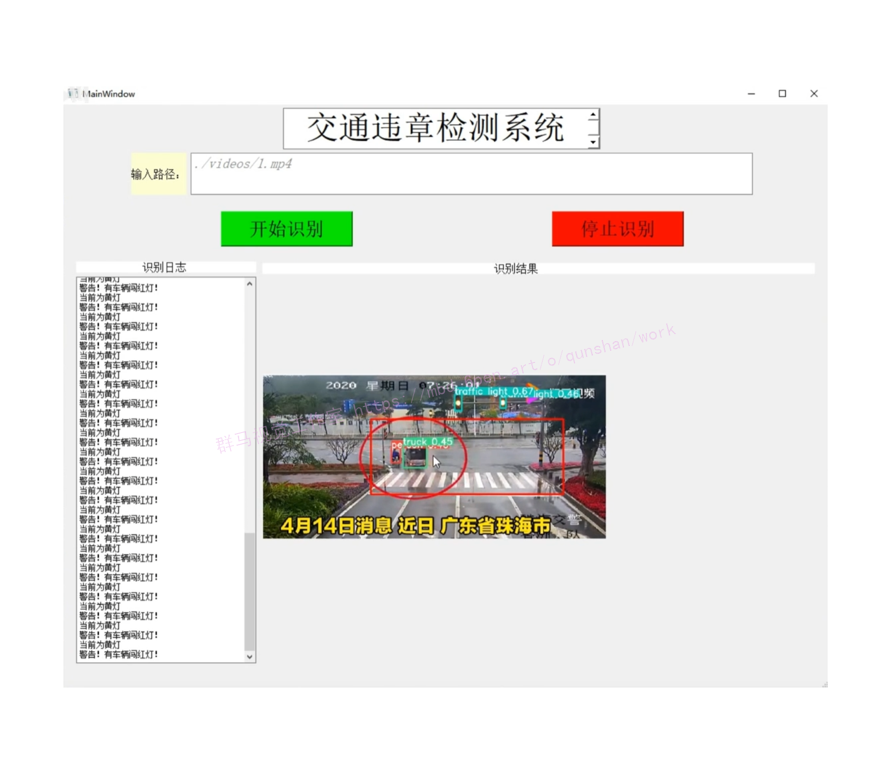
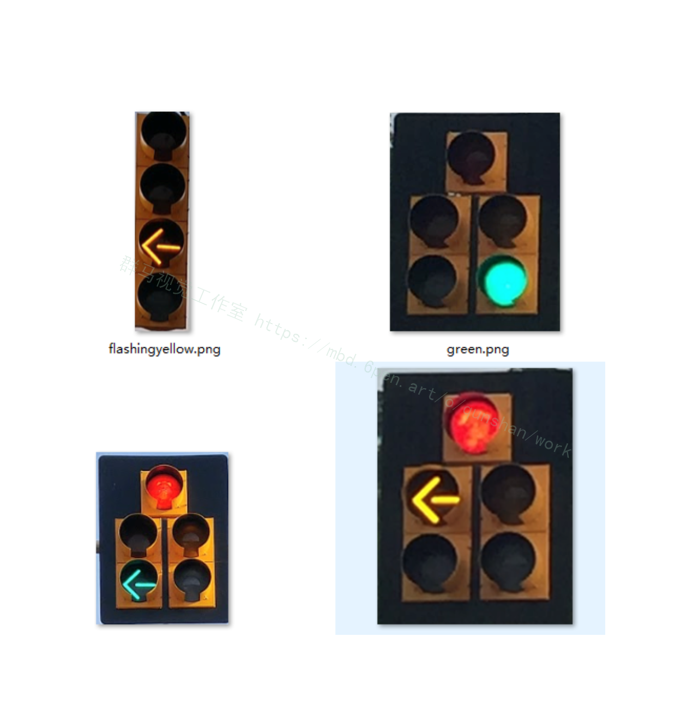
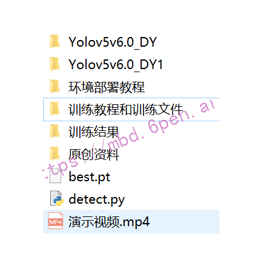


# 1.项目展示





# 2.视频演示
[Python基于YOLO＆Deepsort的闯红灯检测系统（完整源码＆自定义UI操作界面＆视频教程）_哔哩哔哩_bilibili](https://www.bilibili.com/video/BV1va411R7KL/?vd_source=bc9aec86d164b67a7004b996143742dc)

# 3.红绿灯检测
交通信号灯的检测与识别是无人驾驶与辅助驾驶必不可少的一部分，其识别精度直接关乎智能驾驶的安全。一般而言，在实际的道路场景中采集的交通信号灯图像具有复杂的背景，且感兴趣的信号灯区域只占很少的一部分。针对这些难点，国内外的众多研究者提出了相应的解决方案。总的来说，大多基于传统的图像处理方法；但目前也有用强学习能力的卷积神经网络去进行识别，但这类方法往往需要大量的训练样本避免过拟合的风险。截至目前的大多数方法都是在各种颜色空间中利用信号灯颜色的先验进行分割得到兴趣区域，然后再通过信号灯所特有的形状特征和角点特征等进行进一步的判定。比如，Masako Omachi等人提出在RGB色彩空间分割交通信号灯，使用HOUGH变换检测分割出的信号灯所在的圆形区域；徐成等提出在Lab色彩空间分割交通信号灯，使用模板匹配的方法识别交通信号灯的状态；谷明琴等则在HSV色彩空间中使用颜色直方图统计图像的H分量，确定交通信号灯的类型。[参考该博客](https://mbd.pub/o/bread/Yp6clZdt)，本项目将基于传统的图像处理算法来进行交通信号灯的识别，重点介绍核心技术。


# 4.红绿灯检测代码实现
[参考博客](https://afdian.net/item?plan_id=68cfc6185e4111ed9f5052540025c377)
```
import cv2
import random
import numpy as np
from enum import Enum
from detectColor import detectColor
import matplotlib.pyplot as plt
import matplotlib.image as mpimg
class TLState(Enum):
    red = 1
    yellow = 2
    green = 3
    red_yellowArrow = 4
    red_greenArrow = 5
    green_yellowArrow = 6
    green_greenArrow = 7
    redArrow = 8
    yellowArrow = 9
    greenArrow = 10
    flashingYellowArrow = 11
class TLType(Enum):
    regular = 0
    five_lights = 1
    four_lights = 2
def imgResize(image, height, inter = cv2.INTER_AREA):
    dim = None
    (h, w) = image.shape[:2]
    r = height / float(h)
    dim = (int(w * r), height)
    # resize the image
    resized = cv2.resize(image, dim, interpolation = inter)
    # return the resized image
    return resized
def detectState(image, TLType):
    image = imgResize(image, 200)
    (height, width) = image.shape[:2]
    output = image.copy()
    gray = cv2.cvtColor(image, cv2.COLOR_BGR2GRAY)
    # 霍夫圆环检测
    circles = cv2.HoughCircles(gray,cv2.HOUGH_GRADIENT,1,20,
                            param1=50,param2=30,minRadius=15,maxRadius=30)
    overallState = 0
    stateArrow = 0
    stateSolid = 0
    if circles is not None:
        circles = np.uint16(np.around(circles))
        for i in circles[0,:]:
            if i[1] < i[2]:
                i[1] = i[2]
            roi = image[(i[1]-i[2]):(i[1]+i[2]),(i[0]-i[2]):(i[0]+i[2])]
            color = detectColor(roi)
            if color > 0:
                if TLType == 1 and i[0] < width/2 and i[1] > height/3:
                    stateArrow = color
                elif TLType == 2:
                    stateArrow = color
                    if i[1] > height/2 and i[1] < height/4*3:
                        stateArrow = color + 2
                else:
                    stateSolid = color
    if TLType == 1:
        overallState = stateArrow + stateSolid + 1
    elif TLType == 2:
        overallState = stateArrow + 7
    else:
        overallState = stateSolid
    return overallState
def plot_light_result(images):
    for i, image in enumerate(images):
        plt.subplot(1, len(images), i+1)
        lena = mpimg.imread(image)
        label = TLState(detectState(cv2.imread(image),TLType.regular.value)).name
        plt.title(label)
        plt.imshow(lena)
    plt.show()
light_path = ["images/red.jpg","images/green.png", "images/yellow.png"]
random.shuffle(light_path)
plot_light_result(light_path)
def plot_arrow_result(images):
    for i, image in enumerate(images):
        plt.subplot(1, len(images), i+1)
        lena = mpimg.imread(image)
        label = TLState(detectState(cv2.imread(image),TLType.five_lights.value)).name
        plt.title(label)
        plt.imshow(imgResize(lena, 200))
    plt.show()
arrow_path = ["images/red_greenarrow.png", "images/red_yellowarrow.png"]
random.shuffle(arrow_path)
plot_arrow_result(arrow_path)
```
# 6.项目整合
下图[完整源码&环境部署视频教程&自定义UI界面](https://s.xiaocichang.com/s/6da068)

参考文献[《Python基于YOLO＆Deepsort的闯红灯检测系统（完整源码＆自定义UI操作界面＆视频教程）》](https://mbd.pub/o/qunma/work)

# 7.参考文献

[1]张光旭.非理想条件下视频序列人脸识别算法研究与实现[D].河北科技大学,2019,.

[[2]白雪.人工智能技术在智慧交通领域的应用研究[J].产业与科技论坛,2019,(10):49-50.](https://doc.taixueshu.com/journal/20190027cyykjlt.html#origin=3)

[[3]华佳峰.吴昌成.袁晓君.行人闯红灯治理措施及建议[J].中国公共安全（学术版）,2019,(4):86-88.](https://doc.taixueshu.com/journal/20190086zgggaq-xsb.html#origin=3)

[[4]韩玉鹏.阎春利.杨淇.李昕.徐琳琳.罗晓亮.道路交叉口3D光屏信号装置研究[J].山西建筑,2019,(9):131-132.](https://doc.taixueshu.com/journal/20192247shanxjz.html#origin=3)

[[5]李随伟.李刚柱.行人动态实时监测系统的设计与实现[J].信息技术,2020,(5):15-20.](https://doc.taixueshu.com/journal/20200253xxjs.html#origin=3)


---
#### 如果您需要更详细的【源码和环境部署教程】，除了通过【系统整合】小节的链接获取之外，还可以通过邮箱以下途径获取:
#### 1.请先在GitHub上为该项目点赞（Star），编辑一封邮件，附上点赞的截图、项目的中文描述概述（About）以及您的用途需求，发送到我们的邮箱
#### sharecode@yeah.net
#### 2.我们收到邮件后会定期根据邮件的接收顺序将【完整源码和环境部署教程】发送到您的邮箱。
#### 【免责声明】本文来源于用户投稿，如果侵犯任何第三方的合法权益，可通过邮箱联系删除。